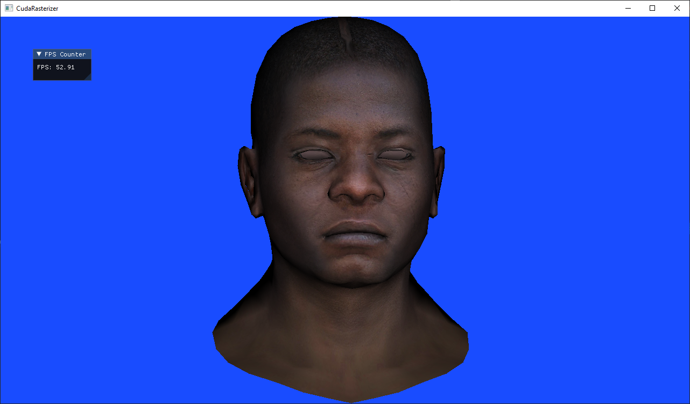

# CUDA Rasterizer

# Goal
Testing the [CUDABase](https://github.com/minchopaskal/CUDAPlayground) and [D3D12Base](https://github.com/minchopaskal/D3D12Base) APIs for their usability
and delving into the rasterization process. The end goal is for the user to be able to write vertex and pixel shaders, load a basic `.obj` model and enable
or disable depth testing. I may probably add more features and optimize the rendering in the future, but that will not be a priority.

## Implementation
The project is build on top of the two APIs I linked above. The CUDABase API  is used to communicate to a CUDA capable GPU.
All the rasterization computations are done via CUDA. The D3D12Base is a DirectX12 API which is only used in this project to blit the
rasterized image to the screen. The CUDA rendered image is send to DX12 as a texture and a screen-quad with that texture is drawn to the
screen.

The rendering itself is implemented by using the `Dynamic Parallelism` feature of CUDA. First the vertices are processed using the supplied vertex shader(if any).
Then for each primitive(in our case these are only triangles) we launch one CUDA thread and prepare data for drawing it. That would be
the triangle's bounding box - we will test each pixel in its bounding box and if it's in the triangle we will draw it(see [TinyRenderer](https://github.com/ssloy/tinyrenderer)).
This is also the step in which we discard any back/front-faces if back/front-face culling was enabled.
After the bounding boxes are prepared from each thread we launch a new CUDA kernel with as many threads as there are pixels in the bounding box. Thus each thread
will check for one pixel only(this could be optimized using hierarchical rasterization, see this excelent [blogpost](https://fgiesen.wordpress.com/2011/07/09/a-trip-through-the-graphics-pipeline-2011-index/amp/?__twitter_impression=true)).
During this stage we do a simple check using the barycentric coordinates of the pixel. If it's not discared and depth testing is enabled
we do it and possibly update the depth buffer using atomics. Finally, if the depth test passed we call the pixel shader and save the result in the render target buffer.
When all is drawn the buffer is downloaded back to the CPU and then send as a texture to DirectX12.

## Supported Features
* **Index drawing of triangles**. The only supported mode for now.
* **Vertex/Pixel shaders**. They only have access to UAV resources that the user can supply via the rasterizer API and also the width/height of the buffer.
* **Depth testing**. Can be enabled/disabled by the user, during rendering.
* **Back-face culling**. It can also be enabled/disabled.
* **UAV resources**. The user can send up to 64 resources with random size and layout to the GPU, which can be used freely by the shaders.

## Rasterizer API
This project supplies a basic rasterization API, which should look familiar to OpenGL users.
It's a stateful API and all of the calls are blocking, i.e the thread calling one of these functions
will block until the GPU has finished its work.

```
/// Enable/disable depth testing
CUDAError setUseDepthBuffer(bool useDepthBuffer);

/// Upload vertex buffer
CUDAError setVertexBuffer(const Vertex* buffer, SizeType verticesCount);

/// Upload index buffer
CUDAError setIndexBuffer(const unsigned int* buffer, SizeType indicesCount);

/// Upload UAV buffer
CUDAError setUavBuffer(const void *buffer, SizeType size, int index);

/// Set the shader program. `name` should be a name of a valid `.ptx` file.
CUDAError setShaderProgram(const String &name) const;

/// The draw call. The index and vertex buffers should be uploaded.
CUDAError drawIndexed(const unsigned int numPrimitives) const;

/// Set the clear color. It will be later used by the clearRenderTarget() call.
CUDAError setClearColor(const Vec4 &color) const;

/// Enable/disable back/front-face culling, depending on the type.
CUDAError setCulling(CudaRasterizerCullType cullType) const;

/// Clear the render target. If no clear color was specified black is used.
CUDAError clearRenderTarget();

/// Clears the depth buffer.
CUDAError clearDepthBuffer();
```

## Build
### What you'll need
* Visual Studio 2019 (Community Edition would suffice)
* CUDA >=10
* NVidia GPU with compute capability >=5.2, which is also DX12 compatible.
* CMake >=3.14

### Instalation
I recommend using the CMake GUI.
* Tell the UI where the project is and where do you want it built.
* Select the `D3D12_COMPILE_SAMPLE_PROJECTS` option in order for this project to be built.
* Configure -> Generate -> Open Project
* A sample project using the API is located as follows: `SampleProjects/CudaRasterizer/Test/CudaRasterizerTest`. When built it must look as shown in the [Preview](#preview) section.

### Usage
If one wants to try out the rasterizer, one should create a `CudaRasterizer` instance passing one or more ptx files for shaders.
Then it's mandatory to call `setUpdateFramebufferCallback` which would just be the frame update function and that's all! See the 
[`CudaRasterizerTest`](test/) project for more details.
  * In order to write vertex/pixel shader one must create a cuda file in which to include the `rasterizer_utils.cuh` file. The shader functions must have the following signature

    ```
       // Vertex shader
       typedef Vertex(*)(const Vertex*, UniformParams params);
       
       // Pixel shader
       typedef float4(*)(const Vertex*, UniformParams params);
    ```
    And the following function should be inside the file with the shaders:
    ```
       extern "C" {
         __global__ void getShaderPtrs_XXX(CUDAShaderPointers *shaderPtrs) {
           shaderPtrs->vsShaderPtr = &vertexShaderFunctionName;
           shaderPtrs->psShaderPtr = &pixelShaderFunctionName;
         }
       }
    ```
    Where XXX is the name one will pass to the API in order to load the shaders.
    The file must be compiled to ptx. The user can choose to do so by oneself or use the supplied `compilePtx` function in the top-level CMake file of this project.
    This process is also shown in the [`CudaRasterizerTest`](test/res/gpu) project.

## Preview
*FPS not disclosed!*



## TODOs
* Speed related
  * Hierarchical rasterization and depth testing.
  * If two triangles share a border pixels alongside it may be drawn twice. Implement proper check for that.
  * Implement double-buffering.
* Useful exercises
  * Implement proper `.obj` reading in the test project.
  * Support for other types of shaders, for example geometry, tessellation.
  * Implement multi-sampling.
  * Change the backend so the project is not dependent on `D3D12Base`

## Resources
* [Tiny Renderer](https://github.com/ssloy/tinyrenderer)
* [A trip through the Graphics Pipeline](https://fgiesen.wordpress.com/2011/07/09/a-trip-through-the-graphics-pipeline-2011-index/amp/?__twitter_impression=true)
* [CUDA docs](https://docs.nvidia.com/cuda/cuda-c-programming-guide/index.html)
* [DirectX12 docs](https://docs.microsoft.com/en-us/windows/win32/direct3d12/directx-12-programming-guide)